# Nova – native KI-Assistenz-App (iOS & Android)

Erstes lauffähiges Produkt nach dem Plan in [`docs/plan/`](docs/plan/README.md). Arbeitstitel „Nova“ und Domain `example.com` sind Platzhalter (änderbar in `cms/content/de/settings.json` bzw. im CMS).

| Teil | Technik | Ordner | Stand |
|---|---|---|---|
| Backend-API | Kotlin, Ktor, PostgreSQL | `backend/` | ✅ läuft, 10 Integrationstests |
| CMS für alle Texte | Strapi 5 | `cms/strapi/`, Texte in `cms/content/de/` | ✅ läuft, importiert Texte automatisch |
| Gemeinsame App-Logik | Kotlin Multiplatform | `shared/` | ✅ End-to-End-Test gegen das Backend |
| Android-App | Jetpack Compose | `apps/android/` | ✅ APK baut, Klick-Durchlauf mit Screenshots |
| iOS-App | SwiftUI | `apps/ios/` | ✅ baut in der CI auf macOS (Simulator); auf echtem Gerät noch nicht getestet |
| CI/CD | GitHub Actions, Cloud Run | `.github/workflows/` | ✅ angelegt |
| Zentraler Login | Keycloak 26 (Passkeys, Gruppen = Corps-Rollen) | `infra/hosting/keycloak/` | ✅ SSO in Cloud, Website und App getestet |
| Cloud | Nextcloud 32, Dateien auch in der App | `infra/hosting/` | ✅ läuft lokal, Umzugsplan steht |
| Website | WordPress, Login nur für die Redaktion | `infra/hosting/wordpress/` | ✅ läuft lokal |
| Datensicherung | restic → Google Cloud Storage (eigenes Projekt, Löschschutz), Offsite-Kopie, Jahresarchiv | `infra/backup/`, `infra/terraform/backup/` | ✅ Sicherung + Wiederherstellung getestet |

## Was schon funktioniert

- **Anmeldung ohne Passwort:** Code per E-Mail, „Mit Google/Apple anmelden“ (sobald OAuth-Client-IDs eingetragen sind)
- **Geräteschlüssel:** Jedes Gerät erzeugt einen Schlüssel im Sicherheitschip (Android Keystore / Secure Enclave). Sitzungen lassen sich nur mit diesem Schlüssel verlängern, gestohlene Tokens sind auf anderen Geräten wertlos.
- **Risikoprüfung bei jeder Anmeldung:** neues Gerät, neues Land, unmögliche Reise, VPN, Fehlversuche → durchlassen, Zusatzbestätigung per SMS oder blockieren
- **Handynummer per SMS oder Anruf** bestätigen; SMS-Texte im GSM-7-Zeichensatz, ohne Links, mit Autofill-Zeile
- **Sicherheits-E-Mails** (neue Anmeldung, Faktor geändert, Konto gesperrt …) mit „Das war ich nicht“-Link, der nur sperren kann, und persönlichem Anti-Phishing-Code
- **Links aus dem CMS** werden vor dem Versand gegen erlaubte Domains geprüft
- **Onboarding-E-Mail-Strecke** (Tag 1, 3, 7, 14) mit Bedingungen und Abmeldelink
- **Chat mit Live-Antwort** (Streaming), Verlauf, Abbrechen, Löschen
- **Geräteliste**, „Alle anderen Geräte abmelden“, letzte Sicherheitsaktivität
- **Rollen:** jedes Konto hat einen Workspace mit Rolle Inhaber:in (Admin, Mitglied, Gast vorbereitet)
- **Alle Texte aus dem CMS:** Änderung in Strapi → sofort in der App, ohne Update; offline gilt die eingebaute Fassung

## Corps Chattia: Cloud, Website, zentraler Login und Backup

Ein Konto für alles: Mitglieder melden sich mit ihrem **Chattia-Konto** (Keycloak) an der Cloud, an der Website (Redaktion) und in der App an.

- **Zentraler Login** mit Passkeys; **zweiter Faktor Pflicht** für Chargen, AHV-Vorstand und IT
- **Gruppen = Corps-Rollen** (Aktivitas, Füxe, Alte Herren, Chargen …) – gepflegt nur in Keycloak, wirksam in Cloud, Website und App
- **Team-Ordner** je Charge und Gruppe (Amt Senior, Kasse, Fuchsenstall …): Unterlagen gehören dem Amt, nicht der Person
- **App:** Cloud-Dateien, **Semesterprogramm** (inkl. interner Termine) und der **Chattia-Assistent**, der Fragen aus den Cloud-Dokumenten beantwortet – jeweils mit genau den Rechten des Mitglieds
- **Website:** öffentliche Termine erscheinen automatisch aus dem Cloud-Kalender
- **Backup:** restic in ein eigenes Google-Cloud-Projekt mit Löschschutz, Offsite-Kopie, verschlüsseltes 10-Jahres-Archiv; **Notfallübung bestanden** (komplette Plattform in 95 s wiederhergestellt, Daten identisch)
- **Umzug:** Runbook, Kontenübernahme per Skript, Terraform für VM und Backup-Projekt

Details: [docs/plan/zentraler-login.md](docs/plan/zentraler-login.md) · Umzug: [nextcloud-wordpress.md](docs/plan/nextcloud-wordpress.md) · Backup: [backup.md](docs/plan/backup.md) · Ideen fürs Corps: [corps-chattia.md](docs/plan/corps-chattia.md)

| Anmeldung (Keycloak) | Cloud nach SSO | App: Chattia-Konto | App: Team-Ordner | App: Termine | Chattia-Assistent |
|---|---|---|---|---|---|
| 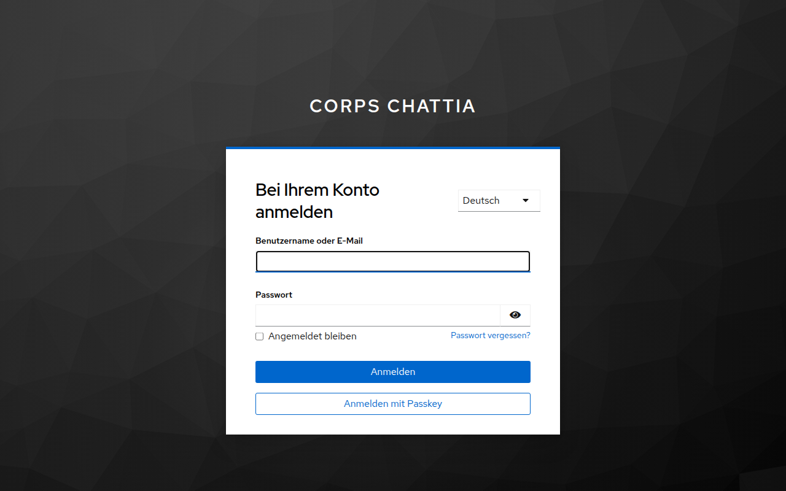 | 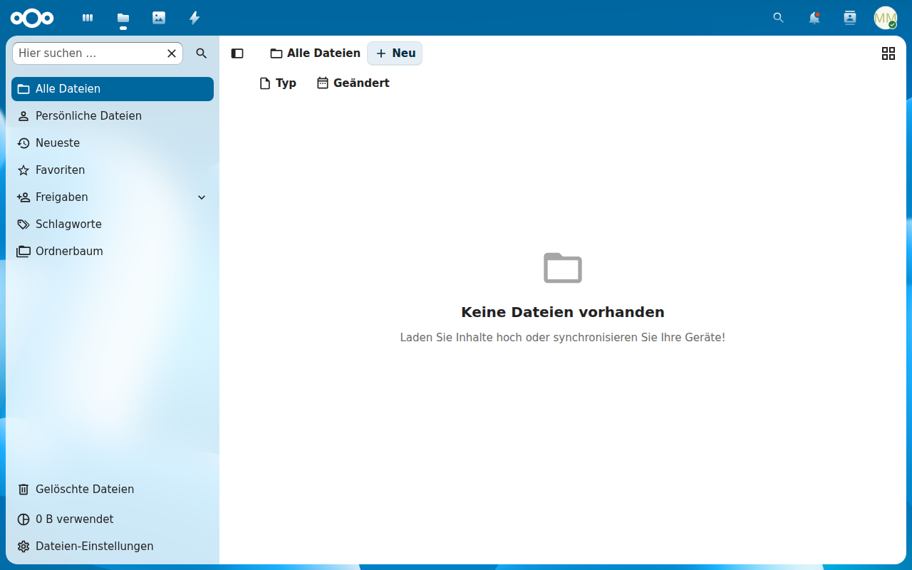 | 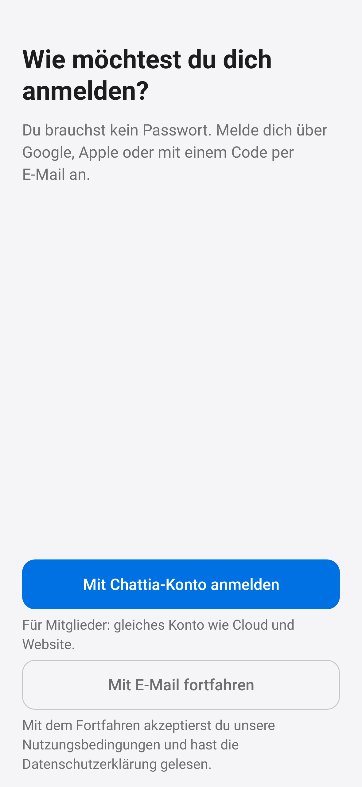 | 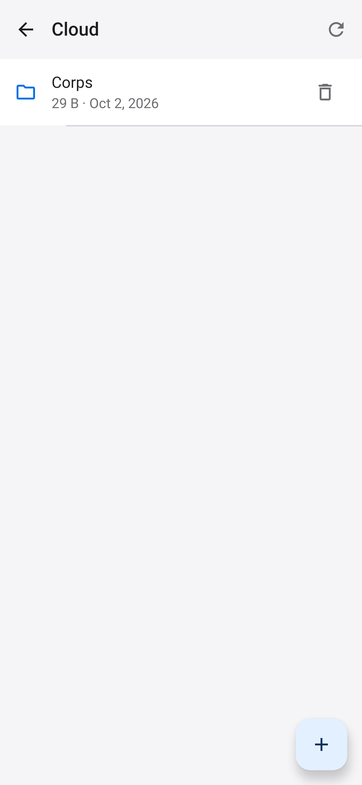 | 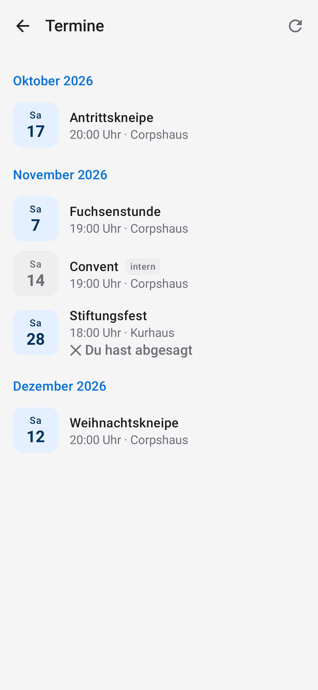 | 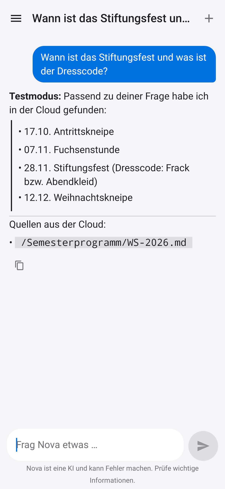 |

## Screenshots (Android, automatisch erzeugt)

| | | |
|---|---|---|
| 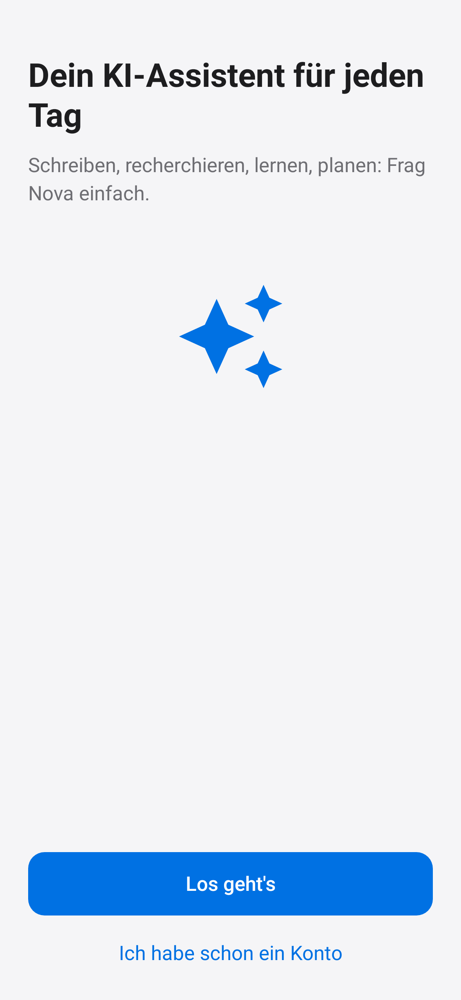 | 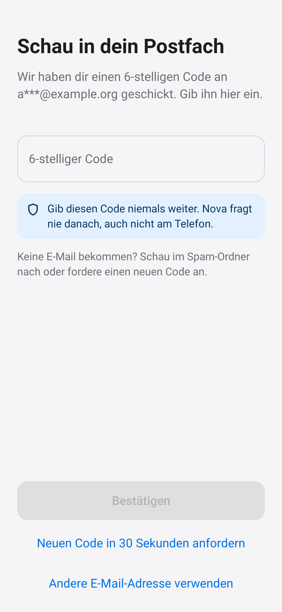 | 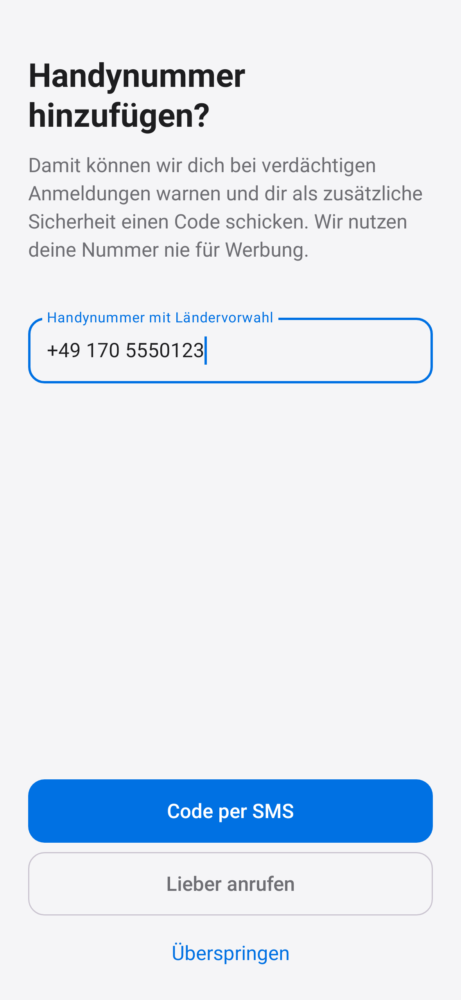 |
| 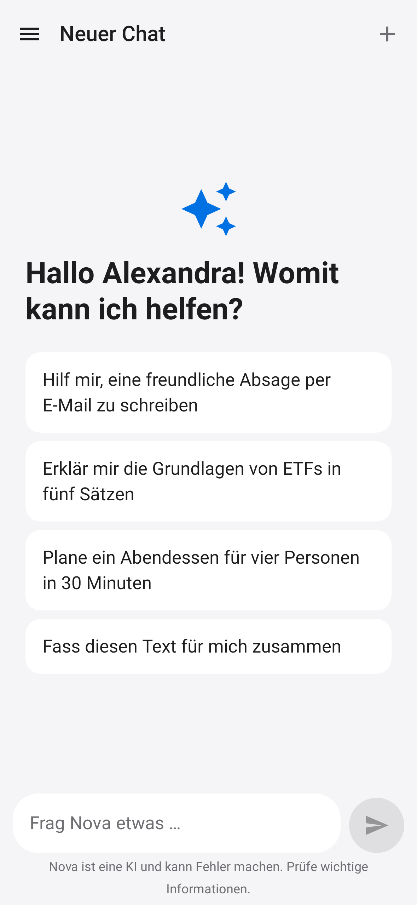 | 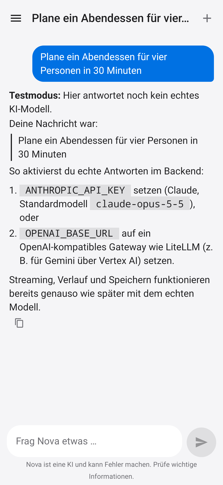 | 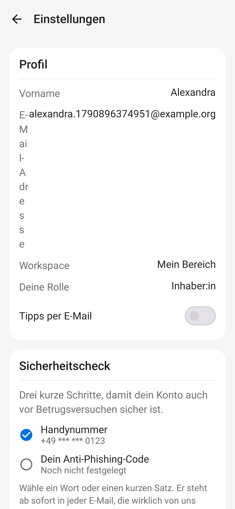 |

**CMS und E-Mails**

| Strapi: alle Vorlagen bearbeitbar | Code-E-Mail mit Warnhinweis | Sicherheits-E-Mail |
|---|---|---|
| 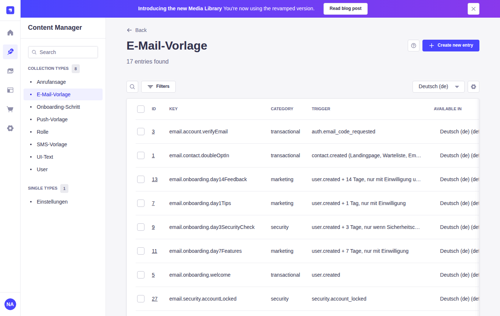 | 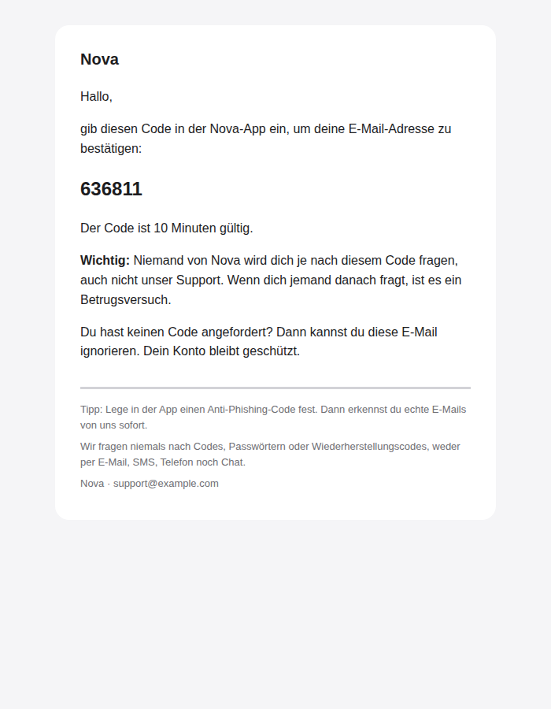 | 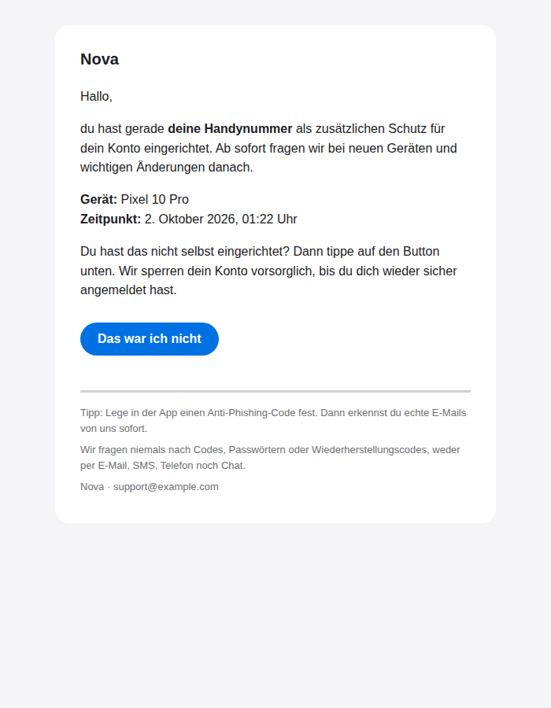 |

## Lokal starten

Voraussetzung: Docker Desktop.

```bash
cp .env.example .env          # optional: ANTHROPIC_API_KEY eintragen für echte KI-Antworten
docker compose up -d --build
```

| Adresse | Was |
|---|---|
| http://localhost:8080/health | Backend |
| http://localhost:1337/admin | Strapi – Anmeldung `admin@example.com` / `NovaAdmin2026!` (lokal) |
| http://localhost:8025 | Mailpit – alle E-Mails, **SMS und Anrufe** der Entwicklung landen hier |

Ohne KI-Schlüssel antwortet ein **Testmodus**. Mit `ANTHROPIC_API_KEY` antwortet Claude (`claude-opus-5-5`), mit `OPENAI_BASE_URL` ein OpenAI-kompatibles Gateway wie LiteLLM (z. B. für Gemini über Vertex AI).

### Android-App

Android Studio öffnen → Projektordner (Wurzel) → App `apps:android` auf einem Emulator starten. Der Emulator erreicht das lokale Backend unter `10.0.2.2:8080` (voreingestellt).

```bash
./gradlew :apps:android:installDebug                          # auf verbundenes Gerät/Emulator
./gradlew :apps:android:assembleRelease -PnovaBackendUrl=https://api.example.com
```

Den Anmeldecode findest du in Mailpit (http://localhost:8025), ebenso die „SMS“.

### iOS-App (Mac mit Xcode 16+)

```bash
brew install xcodegen
cd apps/ios && xcodegen generate && open Nova.xcodeproj
```

Im Simulator starten; das Backend ist unter `localhost:8080` erreichbar. Beim ersten Build baut Xcode automatisch das Kotlin-Framework (`./gradlew :shared:embedAndSignAppleFrameworkForXcode`).

## Tests

```bash
docker compose up -d postgres mailpit                         # Datenbank + Mailpit
(cd backend && ./gradlew test)                                # Backend-Integrationstests
NOVA_BACKEND_URL=http://localhost:8080 ./gradlew :shared:jvmTest              # App-Logik gegen laufendes Backend
NOVA_BACKEND_URL=http://localhost:8080 ./gradlew :apps:android:recordRoborazziDebug   # Klick-Durchlauf + Screenshots
node cms/scripts/validate-content.mjs                         # Texte prüfen
```

## Texte ändern

- **Im CMS** (Strapi): sofort wirksam für Apps und E-Mails. Rollen „Redaktion“ und „Sicherheitsfreigabe“ sind angelegt.
- **Startfassung** in `cms/content/de/*.json`: wird beim ersten Start in Strapi importiert und in die Apps eingebaut.

## Was noch fehlt (nächste Schritte)

1. **Passkeys** (WebAuthn) – Texte und Plan stehen, Server und App-Anbindung fehlen noch
2. **Google-/Apple-Login** produktiv: OAuth-Client-IDs anlegen, Domain-Verknüpfung (`assetlinks.json`, `apple-app-site-association`)
3. **Push-Benachrichtigungen** (Firebase Cloud Messaging) – Texte vorhanden
4. **Twilio** für echte SMS/Anrufe (`PHONE_PROVIDER=twilio` + Zugangsdaten), **E-Mail-Anbieter** (SMTP von Brevo/Mailjet)
5. **Google Cloud**: Projekte, Terraform, Variablen für `deploy.yml` (siehe [docs/plan/cicd-gcp.md](docs/plan/cicd-gcp.md))
6. Workspaces mit Einladungen, Abos (In-App-Kauf)
7. **Corps Chattia:** Umzug nach Runbook, Backup-Projekt per Terraform anlegen, Texterkennung für gescannte PDFs
