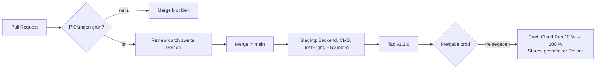

# 11. CI/CD-Pipeline und Google Cloud

[← Zurück zum Plan](README.md)

## 11.1 Repository-Struktur (Monorepo)

```
apps/
  android/          Jetpack Compose
  ios/              SwiftUI (Xcode-Projekt, bindet das KMP-Framework ein)
shared/             Kotlin Multiplatform: API-Client, Auth, Modelle, Texte
backend/            Ktor-Dienste (API, Passkeys, Risiko-Engine)
functions/          Cloud Run functions (E-Mail, SMS, Push, Onboarding-Strecke)
cms/                Strapi 5 (Inhaltstypen als Code) + content/ (Texte) + scripts/
infra/              Terraform für alle GCP-Ressourcen
docs/plan/          Dieser Plan
.github/workflows/  Pipelines
```

Ein Monorepo hat einen großen Vorteil: Eine Änderung an der API, an der App und an den Texten landet in *einem* Pull Request und wird gemeinsam getestet.

## 11.2 Umgebungen

| Umgebung | GCP-Projekt | Wird aktualisiert | Apps |
|---|---|---|---|
| **dev** | `nova-dev` | bei jedem Pull Request (Vorschau) | Debug-Builds |
| **staging** | `nova-staging` | automatisch bei jedem Merge in `main` | TestFlight (intern), Play Console „Interner Test“ |
| **prod** | `nova-prod` | bei Release-Tag `v*`, **nach Freigabe durch eine zweite Person** | App Store, Google Play (gestaffelter Rollout) |

Getrennte Projekte bedeuten getrennte Rechte, Kosten und Daten. Ein Fehler in dev kann prod nicht treffen.

## 11.3 Pipelines (GitHub Actions)

| Pipeline | Auslöser | Schritte |
|---|---|---|
| **PR-Prüfung** | jeder Pull Request | ktlint, detekt, Unit-Tests (shared, backend, android), Android Lint, iOS-Build und -Tests, Texte prüfen, Terraform `plan`, Sicherheitsscans |
| **Backend** | Merge in `main` / Tag | Container bauen → Artifact Registry → Cloud Run staging → Smoke-Tests → (Tag + Freigabe) → prod mit schrittweiser Umleitung des Datenverkehrs (10 % → 100 %) |
| **CMS** | Änderung in `cms/` | Strapi-Container → Cloud Run; Datenbankänderungen der Inhaltstypen laufen beim Start |
| **Android** | Merge in `main` / Tag | Gradle-Build, signieren (Upload-Schlüssel), Upload über Gradle Play Publisher in „Interner Test“ bzw. „Produktion“ (gestaffelt) |
| **iOS** | Merge in `main` / Tag | macOS-Runner, KMP-Framework bauen, `xcodebuild`, Fastlane → TestFlight bzw. App-Store-Einreichung |
| **Texte** | Webhook aus Strapi („veröffentlicht“) und nächtlich | Texte exportieren → prüfen → Pull Request mit den Änderungen nach Git |
| **Infrastruktur** | Änderung in `infra/` | `terraform plan` im PR, `apply` nach Merge (prod nur mit Freigabe) |

Die Texte-Prüfung läuft bereits: [`.github/workflows/content.yml`](../../.github/workflows/content.yml).



**Hinweis zu iOS:** GitHub-Runner mit macOS kosten ein Vielfaches der Linux-Minuten. Deshalb laufen iOS-Builds nur, wenn sich `apps/ios/` oder `shared/` ändert. Alternativ kommt Xcode Cloud infrage, das bei Apple-Entwicklerkonten ein Freikontingent hat.

## 11.4 Geheimnisse und Signierung

- **GitHub → GCP über Workload Identity Federation.** Es gibt keine Schlüsseldatei, die gestohlen werden kann. Jede Pipeline bekommt einen eigenen Service-Account mit genau den nötigen Rechten.
- **Android:** Play App Signing verwaltet den eigentlichen App-Schlüssel bei Google. In der Pipeline liegt nur der Upload-Schlüssel, und zwar im Secret Manager.
- **iOS:** Den Zugang zu App Store Connect regelt ein API-Schlüssel. Zertifikate laufen über Fastlane Match (verschlüsseltes privates Repo) oder automatische Signierung in Xcode Cloud.
- GitHub Environments `staging` und `prod` haben eigene Geheimnisse, und **prod verlangt eine Freigabe durch eine zweite Person**.

## 11.5 Sicherheitsprüfungen in der Pipeline

- **Branch-Schutz für `main`:** Review Pflicht, Prüfungen müssen grün sein, keine Force-Pushes
- **Abhängigkeiten:** Renovate oder Dependabot für Updates, CodeQL für Kotlin und JavaScript
- **Geheimnisse:** GitHub Secret Scanning mit Push-Schutz, dazu ein eigenes Muster für `nova_live_`-Schlüssel
- **Container:** Trivy-Scan, SBOM erzeugen, Images signieren und nur signierte Images auf Cloud Run zulassen (Binary Authorization)
- **Texte:** Platzhalter, Link-Domains und SMS-Zeichensatz prüfen (`cms/scripts/validate-content.mjs`)

## 11.6 Google-Cloud-Dienste

| Dienst | Wofür |
|---|---|
| **Cloud Run** | Backend (Ktor), Passkey-Dienst, LiteLLM, Strapi |
| **Cloud Run functions** (früher Cloud Functions) | E-Mail-, SMS- und Push-Versand, Onboarding-Strecke, Blocking Functions für die Anmeldung |
| **Vertex AI** | Gemini- und Claude-Modelle, Embeddings; verfügbare Modelle in EU-Regionen vorab prüfen |
| **Identity Platform** | Konten, Google-/Apple-Login, E-Mail-Codes, MFA, Custom Claims für Rollen |
| **Firebase App Check** | App-Integrität (Play Integrity, App Attest) |
| **Firebase Cloud Messaging** | Push für Android und iOS (über APNs) |
| **Cloud SQL (Postgres)** | App-Daten und Strapi-Daten (getrennte Datenbanken), pgvector |
| **Cloud Storage** | Uploads, CMS-Medien, Audit-Log mit Aufbewahrungssperre |
| **Pub/Sub, Cloud Tasks, Cloud Scheduler** | Ereignisse, geplante E-Mails, nächtlicher Text-Export |
| **Secret Manager, Cloud KMS** | Geheimnisse, Signierschlüssel |
| **Cloud Armor, reCAPTCHA Enterprise** | WAF, Rate-Limits, Bot- und SMS-Missbrauchsschutz |
| **Identity-Aware Proxy** | Zugang zum Strapi-Admin und zu internen Werkzeugen |
| **Privileged Access Manager** | Zeitlich begrenzte Admin-Rechte |
| **Cloud Logging, Monitoring, Error Reporting** | Betrieb, Alarme |

Außerhalb der GCP (mit Auftragsverarbeitungsvertrag):
- E-Mail-Versand (Brevo oder Mailjet)
- SMS und Anrufe (Twilio Verify)
- Abos (RevenueCat)

## 11.7 Texte zwischen CMS und Git

1. **Einmalig:** Die Startfassung aus `cms/content/de/` wird per Import-Skript in Strapi geladen.
2. **Danach wird im CMS gearbeitet.** Bei jeder Veröffentlichung schickt Strapi einen Webhook an GitHub (`repository_dispatch`).
3. Die Pipeline **Texte** exportiert alle veröffentlichten Inhalte, prüft sie und öffnet einen Pull Request mit den geänderten JSON-Dateien.
4. Nach dem Merge nehmen die App-Builds die neue Fassung als eingebaute Grundfassung mit.

Ergebnis: Die Redaktion arbeitet bequem im CMS, und gleichzeitig ist jede Textänderung in Git versioniert, prüfbar und rückgängig zu machen.

## 11.8 Was du in der Google Cloud vorbereiten musst

Für den Anfang braucht niemand Zugriff auf deine GCP. Wenn es losgeht:

1. **Organisation und Abrechnung:**
   - GCP-Organisation (über Google Workspace oder Cloud Identity)
   - Rechnungskonto
   - **Budget-Alarme** pro Projekt
2. **Organisationsrichtlinien:**
   - Ressourcen nur in EU-Regionen (`gcp.resourceLocations`)
   - Keine Service-Account-Schlüssel (`iam.disableServiceAccountKeyCreation`)
   - Hardware-Schlüssel für alle Admins
3. **Bootstrap:**
   - Ein Projekt `nova-bootstrap` mit Terraform-State-Bucket
   - Workload Identity Federation für das GitHub-Repo
   - Alles Weitere legt Terraform an.
4. **Zugriff für Claude (falls gewünscht):**
   - Ausschließlich auf **dev**
   - Über einen eigenen Service-Account mit minimalen Rechten
   - Wird nach der Aufgabe wieder entzogen
   - Produktion bleibt der Pipeline und dir vorbehalten
