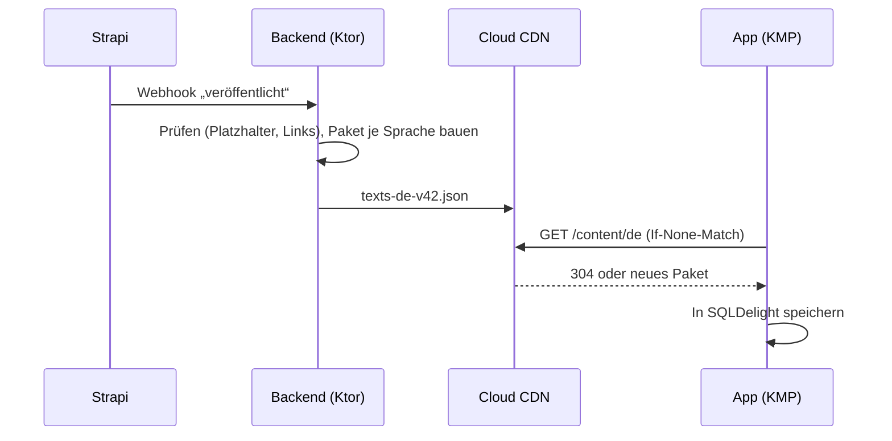

# 10. CMS: Strapi für alle Texte

[← Zurück zum Plan](README.md)

## 10.1 Passt Strapi zu einer Kotlin-App?

**Ja.** Strapi ist ein *Headless*-CMS: Es läuft als eigener Dienst (Node.js) und liefert Inhalte über eine REST- oder GraphQL-API als JSON aus. In welcher Sprache die App geschrieben ist, spielt dafür keine Rolle. Im KMP-Shared-Modul ruft der Ktor-Client die Texte ab, und kotlinx.serialization wandelt sie in Kotlin-Datenklassen um. Für iOS und Android ist das derselbe Code.

Du kannst also deine Strapi-Erfahrung nutzen. Ein Kotlin-CMS gibt es in dieser Reife nicht, und es bringt hier auch keinen Vorteil.

## 10.2 Grundprinzip: Struktur im Code, Inhalte im CMS

| Was | Wo | Wer ändert es |
|---|---|---|
| Inhaltstypen (Felder, Regeln) | Git (`cms/src/api/**/schema.json`) | Entwicklung, über CI/CD |
| Texte, E-Mails, SMS, Onboarding | Strapi (Datenbank) | Redaktion und Sicherheitsfreigabe, direkt im CMS |
| E-Mail-Layout (Kopf, Fuß, Farben) | Git (MJML) | Entwicklung |
| Startfassung aller Texte | Git ([`cms/content/de/`](../../cms/content/de/)) | Wird einmal importiert, danach regelmäßig aus dem CMS exportiert (Abschnitt 11.7) |

So kannst du jeden Text nachträglich im CMS ändern, ohne App-Update und ohne Deployment. Gleichzeitig bleibt jede Fassung in Git nachvollziehbar.

## 10.3 Inhaltsmodell

Alle Typen sind mit **i18n** (Mehrsprachigkeit) und **Entwurf/Veröffentlichen** angelegt.

| Inhaltstyp | Felder | Startdatei |
|---|---|---|
| **Einstellungen** (Single Type) | `appName`, `domain`, `supportEmail`, `allowedLinkDomains`, `globalPlaceholders` | `settings.json` |
| **UI-Text** | `key`, `text`, `description` (Hinweis für die Redaktion), `category`, `placeholders` | `ui-texts.json` |
| **Onboarding-Schritt** | `key`, `order`, `title`, `body`, `primaryCta`, `secondaryCta`, `tertiaryCta`, `skippable`, `condition`, `image` | `onboarding-steps.json` |
| **E-Mail-Vorlage** | `key`, `category` (transactional / security / marketing), `trigger`, `subject`, `preheader`, `body` (Markdown-Absätze), `ctaLabel`, `ctaUrl`, `placeholders` | `email-templates.json` |
| **SMS-Vorlage** | `key`, `text`, `placeholders` | `sms-templates.json` |
| **Anrufansage** | `key`, `text` (für Text-to-Speech), `placeholders` | `voice-templates.json` |
| **Push-Vorlage** | `key`, `title`, `body`, `placeholders` | `push-templates.json` |
| **Rolle** | `key`, `scope` (workspace / internal), `name`, `description`, `permissions` | `roles.json` |

Die Texte für **Sicherheit, E-Mail, SMS, Anruf und Push** liegen in eigenen Inhaltstypen. So kann die Rolle *Redaktion* sie per Strapi-Rechteverwaltung zwar bearbeiten, aber nicht veröffentlichen.

## 10.4 Platzhalter und Regeln

- **Platzhalter** stehen in geschweiften Klammern: `{firstName}`, `{code}`. Erlaubt sind nur die im Feld `placeholders` angegebenen sowie die globalen (`{appName}`, `{domain}`, `{supportEmail}`).
- **Links** dürfen nur auf Domains aus `allowedLinkDomains` zeigen. Fremde Links blockiert das Backend beim Versand, und die CI-Pipeline lehnt sie ab. Das schützt auch für den Fall, dass ein CMS-Zugang gestohlen wird.
- **SMS** dürfen nur den GSM-7-Zeichensatz verwenden (Umlaute und ß sind erlaubt, „Gänsefüßchen“ und Gedankenstriche nicht) und müssen in eine SMS mit 160 Zeichen passen.
- **Fehlender Platzhalterwert** (z. B. kein Vorname): Die Vorlage nutzt den Ersatztext aus `fallbacks` in den Einstellungen („Hallo“ statt „Hallo {firstName}“).

All das prüft das Skript [`cms/scripts/validate-content.mjs`](../../cms/scripts/validate-content.mjs), das in der CI-Pipeline bei jeder Änderung läuft:

```bash
node cms/scripts/validate-content.mjs
```

## 10.5 Auslieferung an die App



- **Eingebaute Grundfassung:** Beim App-Build zieht die CI-Pipeline die aktuellen Texte und legt sie in die App. Die App funktioniert damit beim ersten Start und offline, auch wenn das CMS nicht erreichbar ist.
- **Aktualisierung zur Laufzeit:** Beim App-Start und alle 6 Stunden fragt die App per ETag nach. Das kostet kaum Datenvolumen.
- **Die App spricht nie direkt mit Strapi.** Das CMS ist nicht öffentlich erreichbar, nur das geprüfte Paket über das CDN.
- **E-Mails, SMS und Push** holt das Backend direkt aus Strapi und speichert sie 5 Minuten zwischen.

## 10.6 Zugang und Freigabe im CMS

- Das Strapi-Admin-Panel liegt hinter **Identity-Aware Proxy** (IAP) der Google Cloud. Anmelden kann sich nur, wer ein Konto in deinem Google Workspace hat, mit erzwungener 2FA bzw. Hardware-Schlüssel. Das ersetzt die kostenpflichtige SSO-Funktion von Strapi.
- Strapi-Rollen:
  - **Super Admin:** Entwicklung, maximal 2 Personen
  - **Redaktion:** UI-Texte und Onboarding entwerfen und veröffentlichen
  - **Sicherheitsfreigabe:** E-Mail-, SMS-, Anruf- und Push-Vorlagen veröffentlichen

  Eigene Rollen sind in der Community Edition möglich. Audit-Logs und Review-Workflows sind kostenpflichtig; den aktuellen Stand der Strapi-Editionen bitte vor der Entscheidung prüfen.
- Jede Veröffentlichung löst einen Export nach Git aus (Abschnitt 11.7). Damit gibt es eine lückenlose Änderungshistorie, auch ohne Strapi-Audit-Log.

## 10.7 Mehrsprachigkeit

Deutsch ist die Ausgangssprache. Weitere Sprachen legst du in Strapi als Locale an, z. B. `en`. Fehlt eine Übersetzung, zeigt die App den deutschen Text. Die Prüfung in der CI-Pipeline läuft für jede Sprache in `cms/content/<sprache>/`.

## 10.8 Alternativen (zur Einordnung)

| CMS | Vorteil | Warum trotzdem Strapi |
|---|---|---|
| Directus | Arbeitet direkt auf einer bestehenden Postgres-Datenbank | Du kennst Strapi bereits |
| Payload | TypeScript-nativ, sehr flexibel | Weniger Redaktionskomfort für Nicht-Entwickler:innen |
| Firebase Remote Config | Direkt in der GCP | Kein echtes Redaktionssystem, keine Freigaben |
