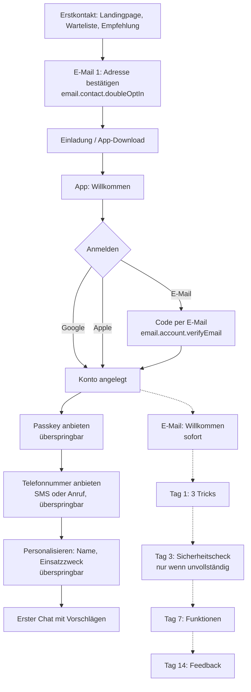

# 9. Onboarding: von der ersten E-Mail bis Tag 14

[← Zurück zum Plan](README.md)

## 9.1 Ziele

- **In unter 90 Sekunden zur ersten Antwort.** Nur Anmeldung ist Pflicht, alles andere kommt später und passend zum Moment.
- **Sicherheit schrittweise aufbauen:** Passkey direkt anbieten. Telefonnummer, Wiederherstellungscodes und Anti-Phishing-Code folgen im Sicherheitscheck an Tag 3, spätestens aber vor der ersten sensiblen Aktion.
- **Jede E-Mail hat genau einen Zweck** und entfällt, wenn er schon erfüllt ist.
- **Alle Texte kommen aus dem CMS.** Die Text-Schlüssel (z. B. `email.onboarding.welcome`) stehen unten in den Tabellen, die Texte selbst in [`cms/content/de/`](../../cms/content/de/).

## 9.2 Gesamtablauf

Wer direkt in der App startet, ohne vorher auf der Landingpage gewesen zu sein, steigt bei „App: Willkommen“ ein. Die erste E-Mail ist dann der Bestätigungscode (E-Mail-Login) bzw. die Willkommensmail (Google/Apple).

## 9.3 App-Onboarding Schritt für Schritt

| # | Schritt | Pflicht? | Text-Schlüssel | Hinweise |
|---|---|---|---|---|
| 1 | Willkommen | ja | `onboarding.welcome` | Ein Bildschirm, kein Karussell |
| 2 | Anmelden | ja | `onboarding.signIn`, `auth.*` | Reihenfolge der Buttons: auf iOS Apple zuerst, auf Android Google zuerst |
| 3 | E-Mail-Code | nur bei E-Mail | `onboarding.verifyEmail` | Autofill aus Mail-Apps; neuer Code nach 30 s |
| 4 | Passkey | nein | `onboarding.passkey` | Wird bei „Später“ nach dem 3. Chat noch einmal angeboten |
| 5 | Telefonnummer | nein | `onboarding.phone` | Wahl: SMS oder Anruf |
| 6 | Telefoncode | nur bei Schritt 5 | `onboarding.phoneVerify` | Warnhinweis „nie weitergeben“ direkt am Eingabefeld |
| 7 | Personalisieren | nein | `onboarding.personalize` | Name und Einsatzzweck (Arbeit, Studium, …). Steuert Chat-Vorschläge und E-Mail-Inhalte |
| 8 | Hinweis KI | ja (einmalig) | `ai.disclaimer` | Transparenzpflicht nach EU AI Act |
| 9 | Erster Chat | ja | `onboarding.firstChat`, `chat.suggestion.*` | Vier Vorschläge passend zum Einsatzzweck |
| – | Benachrichtigungen | nein | `onboarding.notifications` | **Nicht** im Onboarding, sondern beim ersten passenden Moment (z. B. lange Antwort läuft) |
| – | Sicherheitscheck | nein | `security.check.*` | Über die E-Mail an Tag 3 und unter Einstellungen › Sicherheit erreichbar |

## 9.4 E-Mail-Strecke

| Zeitpunkt | Text-Schlüssel | Bedingung | Art |
|---|---|---|---|
| Erstkontakt | `email.contact.doubleOptIn` | Eintrag auf Landingpage/Warteliste | Transaktional (Double-Opt-in) |
| Anmeldung | `email.account.verifyEmail` | Anmeldung per E-Mail | Transaktional |
| Konto angelegt | `email.onboarding.welcome` | immer | Transaktional |
| Tag 1 | `email.onboarding.day1Tips` | Einwilligung „Tipps per E-Mail“ | Marketing |
| Tag 3 | `email.onboarding.day3SecurityCheck` | Sicherheitscheck unvollständig | Transaktional (Kontosicherheit) |
| Tag 7 | `email.onboarding.day7Features` | Einwilligung; nur Funktionen, die es schon gibt | Marketing |
| Tag 14 | `email.onboarding.day14Feedback` | Einwilligung; mindestens 3 Chats | Marketing |

**Sicherheits-E-Mails** sind ereignisgesteuert und kommen immer, unabhängig von Einwilligungen:

| Ereignis | Text-Schlüssel |
|---|---|
| Neue Anmeldung | `email.security.newLogin` |
| 2FA bzw. Passkey eingerichtet | `email.security.mfaEnabled` |
| Sicherheitseinstellung geändert | `email.security.factorChanged` |
| E-Mail-Adresse wird geändert (an die alte Adresse) | `email.security.emailChangeOldAddress` |
| Kontowiederherstellung gestartet | `email.security.recoveryStarted` |
| Konto gesperrt | `email.security.accountLocked` |
| API-Schlüssel erstellt | `email.security.apiKeyCreated` |
| Einladung in einen Workspace | `email.workspace.invite` |
| Rolle geändert | `email.workspace.roleChanged` |

**Technischer Ablauf:**
1. Das Backend schreibt Ereignisse wie `user.created` oder `security.factor_changed` in **Pub/Sub**.
2. Eine **Cloud Run function** holt die Vorlage aus dem CMS, setzt die Platzhalter ein und rendert sie in das HTML-Layout. Das Layout ist im Code (MJML), der Inhalt kommt aus dem CMS.
3. Der Versand läuft über einen EU-Anbieter, z. B. Brevo oder Mailjet.
4. Die Tagesmails plant **Cloud Tasks** beim Anlegen des Kontos ein. Vor dem Versand wird die Bedingung erneut geprüft.

## 9.5 Einwilligungen

- **Double-Opt-in** ist Pflicht, bevor Marketing-E-Mails gehen (DSGVO, UWG).
- Bei der Anmeldung gibt es eine **nicht vorausgewählte** Checkbox: „Schick mir Tipps und Neuigkeiten per E-Mail (jederzeit abbestellbar)“.
- Transaktionale und Sicherheits-E-Mails brauchen keine Einwilligung, dürfen aber keine Werbung enthalten.
- Push-Erlaubnis wird erst im passenden Moment und mit Erklärung abgefragt.

## 9.6 Messgrößen

| Schritt | Kennzahl | Ziel (Startwert) |
|---|---|---|
| Landingpage → bestätigte E-Mail | Bestätigungsrate | > 60 % |
| App geöffnet → Konto angelegt | Anmeldequote | > 70 % |
| Konto → erste Antwort | Zeit bis zur ersten Antwort | < 90 s |
| Konto → Passkey | Passkey-Quote nach 7 Tagen | > 50 % |
| Tag 3 → Sicherheitscheck abgeschlossen | Abschlussquote | > 30 % |
| Tag 7 aktiv | Rückkehrquote | > 35 % |
