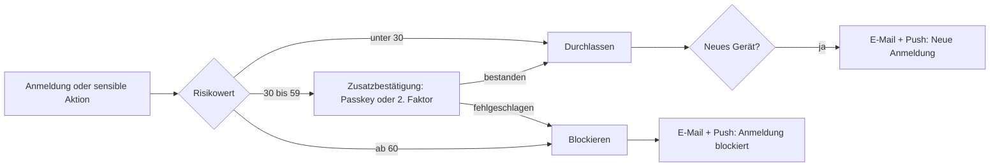

# 8. Sicherheit: Anmeldung, Zwei-Faktor, Rollen und Schlüssel

[← Zurück zum Plan](README.md)

Social Engineering zielt auf Menschen: auf deine Nutzer:innen („Nenn mir kurz den Code aus der SMS“) und auf dein Team („Ich komme nicht mehr in mein Konto, kannst du die Handynummer ändern?“). Das Konzept setzt deshalb an drei Stellen an:

1. **Technik:** Faktoren, die man nicht weitergeben oder abfangen kann (Passkeys, Geräteschlüssel).
2. **Prozesse:** Niemand im Team kann Sicherheitsmerkmale eines Kontos ändern, auch nicht der Support.
3. **Kommunikation:** Eine einzige, überall gleiche Botschaft: *„Wir fragen niemals nach Codes, Passwörtern oder Wiederherstellungscodes, weder per E-Mail, SMS, Telefon noch Chat.“*

## 8.1 Gewohnte Muster statt Eigenerfindungen

Nutzer:innen vertrauen Abläufen, die sie schon kennen. Das Konzept übernimmt bewusst bekannte Muster:

| Muster | Kennt man von | Hier eingesetzt für |
|---|---|---|
| „Mit Google / Apple fortfahren“ | fast allen Apps | Anmeldung ohne Passwort |
| Passkey mit Face ID oder Fingerabdruck | Google, Apple, PayPal, Amazon | Hauptfaktor |
| Code per SMS, Autofill über der Tastatur | Banken, WhatsApp | Zusatzfaktor, Telefonnummer bestätigen |
| „Neue Anmeldung – warst du das?“ | Google, Instagram | Sicherheits-E-Mail und Push |
| Geräteliste mit „Abmelden“ | WhatsApp, Google-Konto | Einstellungen › Sicherheit › Geräte |
| Push-Bestätigung mit Zahlenabgleich | Microsoft Authenticator, Banking-Apps | Anmeldung auf neuem Gerät |
| Wiederherstellungscodes | Google, GitHub | Notfallzugang |
| Anti-Phishing-Code in jeder E-Mail | Krypto-Börsen, einige Banken | Echtheit von E-Mails erkennen |
| Sicherheitscheck mit Häkchen | Google-Sicherheitscheck | Onboarding Tag 3 |
| Rollen Inhaber:in / Admin / Mitglied / Gast | Google Workspace, Slack, GitHub | Teams und Workspaces |

## 8.2 Anmeldemethoden und Faktoren

| Methode | Rolle im Konzept | Schutz vor Social Engineering |
|---|---|---|
| **Passkey** (Face ID, Fingerabdruck, Geräte-PIN) | Hauptfaktor, im Onboarding angeboten | Sehr hoch: an die App/Domain gebunden, kann nicht weitergegeben oder auf Fake-Seiten eingegeben werden |
| **Google-Login** | Bequemer Einstieg, vor allem Android | Hoch: Googles eigene 2FA und Risikoprüfung greifen |
| **Apple-Login** | Bequemer Einstieg, auf iOS **Pflicht**, sobald Google-Login angeboten wird (App-Store-Richtlinie 4.8) | Hoch, inkl. „E-Mail verbergen“ |
| **E-Mail-Code** (6-stellig) | Für alle ohne Google/Apple | Mittel: Code ist weitergebbar. Daher immer mit Warnhinweis |
| **SMS- oder Anruf-Code** | Zusatzfaktor und Nummernbestätigung, **nie alleiniger Faktor für Wiederherstellung oder Kontoänderungen** | Niedrig bis mittel: anfällig für SIM-Swapping und „Nenn mir den Code“ |
| **Authenticator-App (TOTP)** | Optional für Power-User | Mittel |
| **Wiederherstellungscodes** (10 Stück, je einmal nutzbar) | Notfallzugang | Mittel: werden nur einmal angezeigt, Hinweis zur Aufbewahrung |
| **Hardware-Schlüssel** (YubiKey, Titan) | Pflicht für das interne Team, optional für Nutzer:innen | Sehr hoch |

**Empfohlene Umsetzung:**
- **Google Identity Platform** (Teil der GCP) verwaltet Konten, Google- und Apple-Login, E-Mail-Codes, TOTP und Tokens. Mit *Blocking Functions* (`beforeCreate`, `beforeSignIn`) läuft vor jeder Anmeldung die eigene Risikoprüfung.
- **Passkeys** laufen über einen eigenen Dienst im Ktor-Backend (Yubico java-webauthn-server). Nach erfolgreicher Prüfung stellt das Backend ein Identity-Platform-Custom-Token aus. Das ist ein gängiges Muster, da Identity Platform Passkeys nicht selbst anbietet.
- **SMS und Anruf** laufen über **Twilio Verify** (SMS, Sprachanruf, Schutz vor SMS-Pumping). Wenn Anrufe wegfallen, reicht auch die SMS-Funktion von Identity Platform mit *SMS Region Policy*.
- **Alternative:** Zitadel oder Keycloak als selbst betriebenes IAM. Sie bringen Passkeys und Rollen direkt mit, erfordern aber mehr Betriebsaufwand.

**Regeln für SMS- und Anruf-Codes:**
- 6 Ziffern, 10 Minuten gültig, höchstens 5 Eingabeversuche, dann 15 Minuten Sperre
- Letzte Zeile im domain-gebundenen Format: `@app.example.com #123456`, damit das Betriebssystem den Code nur für die echte App bzw. Domain vorschlägt
- **Keine Links in SMS**, nie. Das steht auch so in den Texten
- Versand nur nach bestandener App-Integritätsprüfung (Firebase App Check), mit Rate-Limits pro Nummer, Gerät und IP, und nur in freigegebene Länder
- Anrufe kommen von einer festen, in der App angezeigten Nummer. Die Ansage ist automatisch, es ruft nie ein Mensch an.

## 8.3 Geräteschlüssel: gestohlene Sitzungen sind wertlos

Beim ersten Anmelden erzeugt die App ein Schlüsselpaar im sicheren Hardwarebereich des Geräts: Secure Enclave auf iOS, Android Keystore bzw. StrongBox auf Android. Der private Schlüssel verlässt das Gerät nie.

- Das Backend speichert den öffentlichen Schlüssel als **„bekanntes Gerät“**.
- Jede Token-Erneuerung (und optional jede API-Anfrage) wird mit dem Geräteschlüssel signiert, nach dem Muster DPoP (RFC 9449).
- Ein abgegriffenes Token funktioniert auf keinem anderen Gerät.
- Die Geräteliste in der App zeigt genau diese Schlüssel an. „Abmelden“ widerruft den Schlüssel.
- Zusätzlich bestätigt **Firebase App Check** (Play Integrity bzw. App Attest), dass die Anfrage aus der echten, unveränderten App kommt.

## 8.4 Risikoprüfung: Standort, Verbindungsart, Gerät

Bei jeder Anmeldung und jeder sensiblen Aktion berechnet die Risiko-Engine einen Punktwert:

| Signal | Quelle | Punkte (Startwerte) |
|---|---|---|
| Unbekanntes Gerät (kein Geräteschlüssel) | Backend | +30 |
| Bekanntes Gerät mit gültiger Signatur | Backend | −30 |
| Neues Land gegenüber den letzten 90 Tagen | IP-Geolokalisierung (z. B. MaxMind GeoLite2) | +25 |
| „Unmögliche Reise“ (> 800 km/h zwischen zwei Anmeldungen) | IP-Geolokalisierung | +50 |
| Rechenzentrums- oder Hosting-IP | ASN-Datenbank | +20 |
| VPN oder Proxy erkannt | IP-Datenbank, Geräteangabe (Android: `TRANSPORT_VPN`) | +15 |
| Tor-Ausgangsknoten | öffentliche Tor-Liste | +40 |
| Mehrere Fehlversuche in 15 Minuten | Backend | +20 |
| App-Integrität fehlgeschlagen | App Check | **sofort blockieren** |
| Ungewöhnliche Uhrzeit für dieses Konto | Verlauf | +10 |

**Standort:** Die App fragt **keinen GPS-Standort** ab. Die IP-basierte Schätzung auf Stadt- oder Landesebene reicht für die Sicherheit, braucht keine Berechtigung und ist datensparsamer.

**Verbindungsart:** WLAN, Mobilfunk oder VPN liefert die App mit. Das ist ein *schwaches* Signal, weil das Gerät es frei angeben kann. Auf iOS ist eine VPN-Erkennung nur eingeschränkt möglich. Ausschlaggebend ist die IP-Analyse auf dem Server. In Sicherheits-E-Mails wird die Verbindungsart trotzdem angezeigt („Mobilfunk, Telekom“), weil Nutzer:innen damit ihre eigene Anmeldung leichter wiedererkennen.

**Datenschutz:**
- Rechtsgrundlage ist Art. 6 Abs. 1 lit. f DSGVO (berechtigtes Interesse: Kontoschutz).
- IP-Adressen werden nach 30 Tagen gekürzt; Risikodaten werden nach 90 Tagen gelöscht.
- Die Risikoprüfung wird in der Datenschutzerklärung beschrieben, eine **Datenschutz-Folgenabschätzung** wird empfohlen.

Die Punktwerte sind Startwerte und werden nach dem Launch an echten Daten nachjustiert.

## 8.5 Aktionen, die immer eine Zusatzbestätigung brauchen

Unabhängig vom Risikowert verlangen diese Aktionen eine frische Bestätigung mit Passkey oder zweitem Faktor (nicht älter als 5 Minuten):

- E-Mail-Adresse oder Telefonnummer ändern. **Zusätzlich gilt eine Wartezeit von 24 Stunden**, und die alte Adresse wird informiert.
- Passkey, Authenticator oder Hardware-Schlüssel hinzufügen oder entfernen
- Wiederherstellungscodes neu erzeugen
- API-Schlüssel erstellen
- Rollen vergeben, Workspace-Inhaber:in übertragen (mit 24 Stunden Wartezeit)
- Daten exportieren, Konto löschen, Zahlungsdaten ändern

Jede dieser Aktionen erzeugt eine Sicherheits-E-Mail, eine Push-Nachricht und eine SMS an die bisherigen Kanäle, jeweils mit „Das war ich nicht“.

## 8.6 Rollen

### Nutzerseite (Workspaces, wie Google Workspace oder Slack)

| Rolle | Darf | Darf nicht |
|---|---|---|
| **Inhaber:in** | Alles: Abrechnung, Workspace löschen, Inhaberschaft übertragen, 2FA-Pflicht für alle festlegen | – (kritische Aktionen nur mit Zusatzbestätigung und Wartezeit) |
| **Admin** | Mitglieder einladen und entfernen, Rollen bis „Admin“ vergeben, Assistenten und Richtlinien verwalten | Abrechnung, Inhaberschaft, Workspace löschen |
| **Mitglied** | Chatten, eigene Projekte, geteilte Assistenten und Dateien nutzen | Mitglieder verwalten |
| **Gast** | Geteilte Chats und Projekte lesen und kommentieren | Eigene Chats im Workspace, Dateien hochladen |

Einzelkonten sind technisch ein Workspace mit nur einer Inhaber:in. So gibt es nur ein Rechtemodell.

### Internes Team (Prinzip: jede Person nur so viel, wie sie braucht)

| Rolle | Darf | Darf ausdrücklich nicht |
|---|---|---|
| **Support** | Kontodaten und Metadaten sehen (Geräte, Anmeldungen, Abo); Identitätsbestätigung per Push an die App senden; Wiederherstellung *anstoßen* | **Chat-Inhalte sehen; E-Mail, Telefon oder Faktoren ändern; Wartezeiten verkürzen** |
| **Moderation** | Nur gemeldete Inhalte sehen und bewerten | Konten oder Chats durchsuchen |
| **Redaktion** (CMS) | Texte entwerfen und veröffentlichen, außer Sicherheitstexten | Sicherheitstexte und E-Mail-Vorlagen veröffentlichen |
| **Sicherheitsfreigabe** (CMS) | Sicherheitstexte, SMS und E-Mails freigeben | Infrastruktur |
| **Plattform-Admin** | Infrastruktur, nur mit zeitlich begrenztem Zugriff (GCP Privileged Access Manager) | Dauerhafte Admin-Rechte |
| **Notfallkonto** („Break Glass“) | Alles, nur im Notfall | Nutzung ohne Alarm: jede Anmeldung alarmiert alle Admins |

Rollen werden als *Custom Claims* im Identity-Platform-Token mitgegeben und im Backend bei jeder Anfrage geprüft. Die Apps blenden nur Funktionen aus, die Rechte setzt allein das Backend durch.

Alle Rollennamen und Beschreibungen stehen im CMS: [`roles.json`](../../cms/content/de/roles.json).

## 8.7 Schlüssel und Geheimnisse

| Schlüssel | Wo | Regel |
|---|---|---|
| Passkeys der Nutzer:innen | Gerät bzw. iCloud-/Google-Schlüsselbund | Server kennt nur den öffentlichen Schlüssel |
| Geräteschlüssel | Secure Enclave / Android Keystore | Nicht exportierbar, widerrufbar über die Geräteliste |
| API-Schlüssel für Power-User | Postgres, nur als Hash | Präfix `nova_live_…`; wird nur einmal angezeigt; mit Ablaufdatum und Rechten (z. B. nur „chat:write“); per GitHub Secret Scanning erkennbar machen |
| Signierschlüssel für Tokens und Links | Cloud KMS | Automatische Rotation |
| Datenbank- und Anbieter-Zugangsdaten | Secret Manager | Kein Geheimnis im Code oder in Umgebungsdateien |
| Zugriff CI/CD → GCP | Workload Identity Federation | **Keine** Service-Account-Schlüsseldateien (per Organisationsrichtlinie verboten) |
| App-Signierung | Play App Signing, App Store Connect | Upload-Schlüssel im Secret Manager, siehe [Abschnitt 11](cicd-gcp.md) |

## 8.8 Konkrete Maßnahmen gegen Social Engineering

**1. Ein Versprechen, überall gleich**

„Wir fragen niemals nach Codes, Passwörtern oder Wiederherstellungscodes, weder per E-Mail, SMS, Telefon noch Chat.“ Dieser Satz steht in:
- jeder SMS und jeder Code-E-Mail
- der Code-Eingabe in der App
- der Anrufansage
- dem E-Mail-Fußbereich

**2. Support ohne Telefon-Risiko**
- Kontakt zum Support gibt es **nur aus der App heraus** (Chat oder Formular). Der Support ruft nie von sich aus an.
- Die Identität wird **nicht über vorgelesene Codes** geprüft. Stattdessen schickt der Support eine Push-Anfrage „Identität bestätigen“ an die App, und die Person tippt auf „Ja, das bin ich“. So bleibt die Regel „Codes nie weitergeben“ ohne Ausnahme.
- Das Support-Werkzeug *kann* keine Sicherheitsmerkmale ändern. Wer am Telefon Druck macht, erreicht nichts, weil es technisch nicht geht.

**3. Kontowiederherstellung mit Wartezeit (wie bei Apple)**
- Mit einem Wiederherstellungscode geht es sofort.
- Ohne Code: **72 Stunden Wartezeit**. In dieser Zeit gehen Benachrichtigungen an alle hinterlegten Kanäle, jeweils mit „Wiederherstellung stoppen“.
- Optional für Business-Konten: Identitätsprüfung per Video- oder eID-Verfahren (z. B. IDnow, Veriff).

**4. Echte E-Mails erkennbar machen**
- SPF, DKIM und **DMARC mit `p=reject`** für die Absenderdomain
- Getrennte Subdomains für Transaktions- und Marketing-Mails
- Persönlicher **Anti-Phishing-Code** in jeder E-Mail
- Links nur auf die eigene Domain, keine Link-Kürzer
- Die E-Mail „Konto gesperrt“ enthält **bewusst keinen Link**
- Links mit „Das war ich nicht“ können nur *sperren*, nie entsperren oder anmelden. Ein Missbrauch richtet daher keinen Schaden an.

**5. Push-Bestätigung gegen „Bestätigungs-Müdigkeit“**

Bei der Push-Freigabe einer Anmeldung zeigt das neue Gerät eine Zahl, die auf dem bekannten Gerät ausgewählt werden muss (Zahlenabgleich). Nach 3 abgelehnten Anfragen in einer Stunde wird gesperrt und gewarnt.

**6. Internes Team absichern**
- Hardware-Schlüssel für alle Team-Konten (Google Workspace, GitHub, GCP, Strapi)
- Zugriff auf Produktion nur zeitlich begrenzt und begründet (Privileged Access Manager)
- Vier-Augen-Prinzip: für Produktions-Deployments (GitHub Environments) und für Sicherheitstexte im CMS (Rolle „Sicherheitsfreigabe“)
- **Ein kompromittiertes CMS darf keine Phishing-Mails erzeugen können.** Deshalb prüft das Backend vor dem Versand jeden Link aus CMS-Texten gegen eine Liste erlaubter Domains, und dieselbe Prüfung läuft in der CI-Pipeline.
- Audit-Log aller Admin- und Support-Aktionen (Cloud Audit Logs + eigene Tabelle, unveränderlich in einem Cloud-Storage-Bucket mit Aufbewahrungssperre)
- Jährliche Schulung und Phishing-Simulation für das Team

## 8.9 Umsetzung in Kotlin Multiplatform

| Thema | Shared (KMP) | iOS | Android |
|---|---|---|---|
| Anmeldung | Identity-Platform-REST-API über Ktor, Token-Verwaltung | Sign in with Apple, Google Sign-In SDK | Credential Manager (Google-Login) |
| Passkeys | API-Aufrufe und Datenmodelle | `ASAuthorizationPlatformPublicKeyCredentialProvider` | Credential Manager (`CreatePublicKeyCredentialRequest`) |
| Geräteschlüssel | Signatur-Logik über `expect`/`actual` | Secure Enclave (CryptoKit) | Android Keystore / StrongBox |
| App-Integrität | – | Firebase App Check (App Attest) | Firebase App Check (Play Integrity) |
| SMS-Autofill | – | `textContentType = .oneTimeCode` | SMS User Consent API |
| Verbindungsart | Datenmodell | `NWPathMonitor` | `ConnectivityManager` / `NetworkCapabilities` |
| Sichere Ablage | Schnittstelle | Keychain | EncryptedSharedPreferences / DataStore + Keystore |
