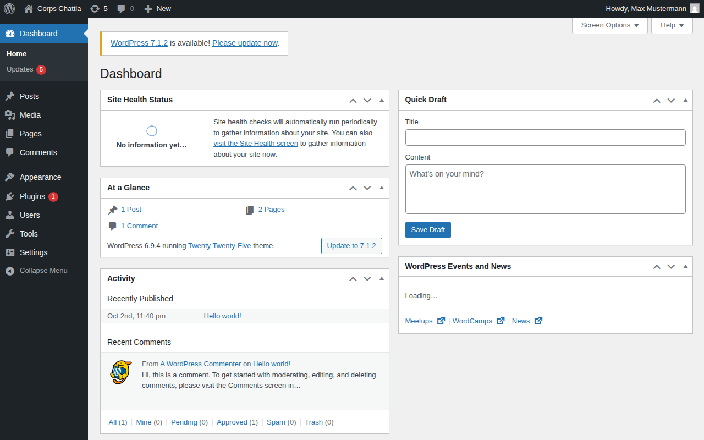
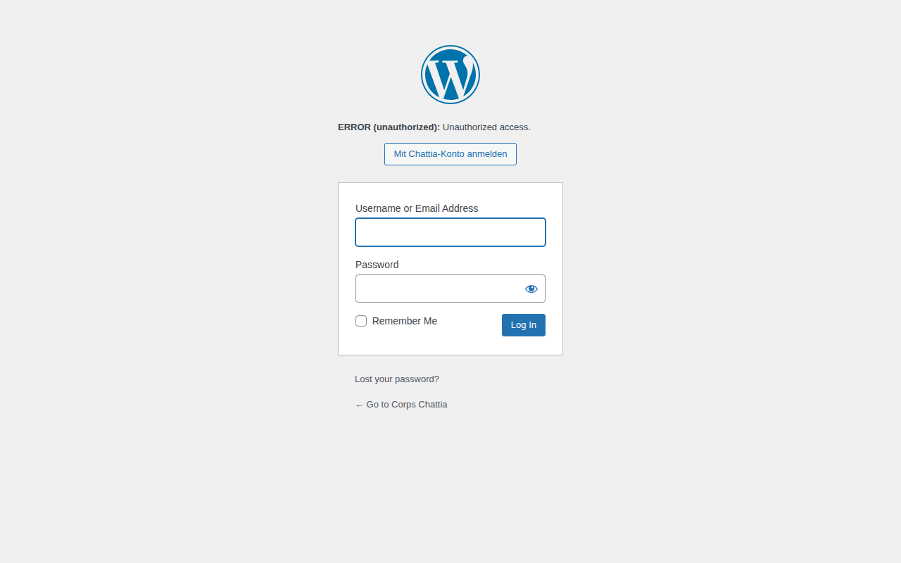

# 12. Zentraler Login: ein Konto für Cloud, Website und App

Stand: Oktober 2026 · Umsetzung: [`infra/hosting/`](../../infra/hosting/), Backend [`central/`](../../backend/src/main/kotlin/com/example/nova/central/)

## Idee

Jedes Mitglied hat **ein** Chattia-Konto. Damit meldet es sich an der Cloud (Nextcloud), an der Website (WordPress, nur Redaktion) und in der Nova-App an. Wer das Corps verlässt oder sein Handy verliert, wird an **einer** Stelle gesperrt, und das wirkt überall.

```
                 ┌──────────────────────────────────────────┐
                 │  Keycloak  auth.chattia.de               │
                 │  Konten · Gruppen · Passkeys · 2FA       │
                 └──────┬──────────────┬──────────────┬─────┘
            OIDC (Code+PKCE)   OIDC (Code)      OIDC (Code+PKCE, BFF)
                        │              │              │
          ┌─────────────▼───┐  ┌───────▼───────┐  ┌───▼────────────────────┐
          │ Nextcloud       │  │ WordPress     │  │ Nova-Backend           │
          │ cloud.chattia.de│  │ chattia.de    │  │ api.chattia.de         │
          │ user_oidc       │  │ OIDC-Plugin   │  │ hält Tokens serverseitig│
          └────────▲────────┘  └───────────────┘  └───┬────────────────────┘
                   │  WebDAV mit dem Token des Nutzers  │
                   └────────────────────────────────────┘
                                                      ▲
                                    Android / iOS ────┘ (nur eigene Sitzung + Geräteschlüssel)
```

**Warum Keycloak?** Open Source (Apache 2.0), seit Jahren Standard, kann Passkeys, TOTP, Brute-Force-Schutz, Gruppen und Admin-Protokoll. Nextcloud und WordPress sprechen OIDC. Alternativen: Authentik (ebenfalls gut, kleinere Community). Nextclouds eingebauter OIDC-Provider wäre schwächer und würde die Cloud zum Single Point of Failure machen.

## Gruppen = Rollen im Corps

Gruppen werden **nur in Keycloak** gepflegt. Nextcloud übernimmt sie bei jeder Anmeldung (auch über die App), WordPress leitet daraus die Rolle ab.

| Keycloak-Gruppe | Wer | Nextcloud | WordPress | Hinweise |
|---|---|---|---|---|
| `aktivitas/burschen` | Corpsburschen | Gruppe `burschen` | – | |
| `aktivitas/fuechse` | Füxe | Gruppe `fuechse` | – | eingeschränkte Gruppenordner |
| `inaktive` | Inaktive | Gruppe `inaktive` | – | |
| `alte-herren` | AHV-Mitglieder | Gruppe `alte-herren` | – | |
| `chargen/senior` … `fuchsmajor` | Chargierte | jeweilige Gruppe | – | 2FA (geplant), Amtsordner |
| `ahv-vorstand` | Kasse, Schriftführung | Gruppe `ahv-vorstand` | – | 2FA (geplant), Zugriff Kasse/Archiv |
| `hausverein` | Hausverwaltung | Gruppe `hausverein` | – | |
| `website-redaktion` | Pflege der Website | – | **Redakteur** | |
| `it-admins` | Technik | Admin-Gruppe | **Administrator** | Hardware-Schlüssel (geplant) |
| `gaeste` | Gäste, Partner | Gruppe `gaeste` | – | nur geteilte Ordner |

Bei einem **Chargenwechsel** (jedes Semester) werden nur die Gruppen in Keycloak umgehängt. Die Amtsordner in Nextcloud („Senior“, „Fuchsmajor“ …) gehören der Gruppe, nicht der Person, und gehen damit automatisch mit.

Hinweis: Keycloak liefert die **direkten** Gruppen (`burschen`, nicht `aktivitas`). Wer Ordner für die ganze Aktivitas braucht, legt sie für `burschen` **und** `fuechse` an oder trägt Mitglieder zusätzlich in `aktivitas` ein.

## Anmeldung

- **Passwort + Passkey/TOTP.** Passkeys (Face ID, Fingerabdruck, Windows Hello) sind bereits aktiv („Anmelden mit Passkey“). Für Chargen, AHV-Vorstand und IT-Admins wird ein zweiter Faktor Pflicht. Das ist noch einzurichten: bedingter Anmeldeablauf je Gruppe in Keycloak, bis dahin per *Required Action* am Konto.
- **Brute-Force-Schutz:** nach 8 Fehlversuchen Wartezeit, steigend bis 15 Minuten.
- **Sitzungen:** 2 h Leerlauf, max. 10 h im Browser; App über Offline-Token bis 30 Tage ohne Nutzung.
- **Notfall-Login:** Nextcloud-Admin `nc-admin` bleibt lokal (`/login?direct=1`) mit langem Passwort im Tresor, falls Keycloak ausfällt.

## Ablauf in der App (Backend-for-Frontend)

1. App öffnet `https://api…/v1/auth/oidc/start?redirect=nova://auth` im System-Browser (Custom Tab bzw. ASWebAuthenticationSession; Safari/Chrome-Cookies → oft kein erneutes Passwort).
2. Keycloak-Login, Rücksprung zum **Backend** (`/v1/auth/oidc/callback`). Das Backend tauscht den Code (PKCE), prüft ID-Token, Nonce, Issuer, Audience und `email_verified`.
3. Backend leitet weiter auf `nova://auth?code=<Einmalcode>`: 2 Minuten gültig, nur einmal einlösbar, gespeichert nur als Hash.
4. App löst den Code mit ihrem **Geräteschlüssel** ein (`/v1/auth/oidc/exchange`). Die normale Risikoprüfung (neues Gerät, Land, …) greift wie bei jeder Anmeldung.

Die Keycloak-Tokens verlassen den Server nie; sie liegen AES-256-GCM-verschlüsselt in der Datenbank. Fängt eine fremde App `nova://auth` ab, nützt ihr der Code nichts: Er ist an die Einlösung mit einem registrierten Geräteschlüssel gebunden, und die Anmeldung erscheint im Sicherheitsprotokoll.

## Dateien in der App

Das Backend greift per WebDAV auf Nextcloud zu, **mit dem Access-Token des Nutzers** (Audience `nextcloud`, von Nextcloud per `user_oidc` geprüft). Das Backend hat keine eigenen Nextcloud-Rechte: Es sieht genau das, was das Mitglied im Browser sieht, inklusive Gruppenordnern und Freigaben. Wer sich noch nie in der Cloud angemeldet hat, wird beim ersten Zugriff automatisch angelegt, inklusive Gruppen.

| API | Funktion |
|---|---|
| `GET /v1/files?path=/Corps` | Ordnerinhalt |
| `GET /v1/files/content?path=…` | Datei laden (Streaming) |
| `PUT /v1/files/content?path=…` | Datei hochladen |
| `POST /v1/files/folder` | Ordner anlegen |
| `DELETE /v1/files?path=…` | löschen (Nextcloud-Papierkorb) |

Pfade werden geprüft (kein `..`, keine Steuerzeichen), WebDAV-Antworten ohne DOCTYPE geparst (Schutz vor XXE).

## Lebenszyklus eines Mitglieds

| Ereignis | Was passiert | Wer |
|---|---|---|
| Keilung/Aufnahme als Fux | Konto in Keycloak anlegen, Gruppe `fuechse`, Einladungsmail „Passwort setzen + Passkey“ | Fuchsmajor oder IT |
| Reception zum Burschen | Gruppe `fuechse` → `burschen` | Senior |
| Inaktivierung | `burschen` → `inaktive` | Senior |
| Philistrierung | → `alte-herren` | AHV-Vorstand |
| Austritt/Ausschluss | Konto **deaktivieren** (nicht löschen), Sitzungen beenden; Dateien nach Satzung übergeben, nach Frist löschen | Senior + IT |
| Handy verloren | Mitglied: „Alle Geräte abmelden“ in der App oder Keycloak-Kontoseite; IT kann Sitzungen zentral beenden | Mitglied/IT |

Optional später: Self-Service-Registrierung mit Freigabe durch den Senior, Synchronisation mit der Mitgliederverwaltung des AHV.

## Lokal ausprobieren

```bash
cd infra/hosting
cp .env.example .env
echo "127.0.0.1 auth.chattia.internal cloud.chattia.internal www.chattia.internal api.chattia.internal" | sudo tee -a /etc/hosts
docker compose up -d                      # erster Start ca. 2–3 Minuten
./dev-trust.sh                            # lokale Zertifizierungsstelle eintragen
docker compose cp keycloak/dev-users.sh keycloak:/tmp/ && docker compose exec keycloak sh /tmp/dev-users.sh
docker compose --profile tools run --rm wpcli   # WordPress einrichten
```

Testkonten: `senior`, `fux`, `altherr`, Passwort `Chattia-Test-2026!`. Dann https://cloud.chattia.internal:8443 (Browser-Warnung zur lokalen CA einmal bestätigen oder `caddy-local-root.crt` importieren).

| Keycloak | Nextcloud nach SSO | WordPress: Redaktion | WordPress: Fux abgewiesen |
|---|---|---|---|
|  |  |  |  |

Automatische Tests: `tests/sso-test.mjs` (Browser: Keycloak → Nextcloud → WordPress mit Rollen) und `tests/nova-files-test.mjs` (App-Ablauf: Login, Einmalcode, Dateien hoch/runter/löschen, Pfadausbruch, ohne Anmeldung). Beide liefen vollständig grün.

## Stolpersteine (gelöst)

- **`*.localhost` funktioniert nicht:** curl/PHP leiten `*.localhost` immer auf den eigenen Container um, Nextcloud fände Keycloak nicht. Deshalb `*.chattia.internal`.
- **Eigene `clientScopes` im Realm-Import** ersetzen die Standard-Scopes (`profile`, `email` …). Der Gruppen-Mapper hängt deshalb direkt an den Clients.
- **Nextcloud blockiert private Adressen** als Identity Provider. `allow_local_remote_servers` ist nur gesetzt, weil Keycloak im selben Docker-Netz läuft.
- **WordPress-Plugin** leitet den Issuer falsch ab (ohne Port/Pfad). Er wird jetzt explizit gesetzt.
